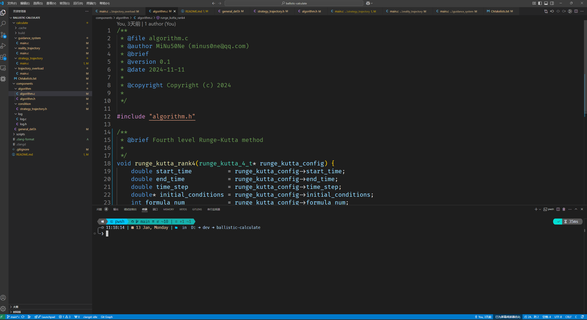

# 制导航弹方案弹道计算

## 工程介绍

### 前言

本课程作业要求应用课程所学计算弹道相关的四道题目，模型计算涉及大量的数学计算，使用matlab内置的函数显然更加简便，但具有运算缓慢的缺点。特此使用更加强大的c语言进行运算代码编写，将运算结果保存后用python脚本进行曲线绘图。

### 工具链

#### vscode+gcc+cmake

vscode作为代码编辑器具有轻量级、扩展性强、跨平台支持等优势，可以使用

vscode编辑器

